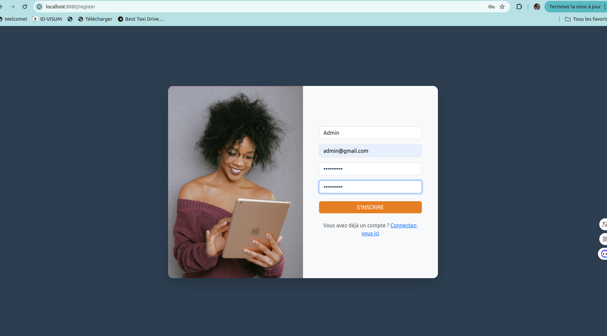
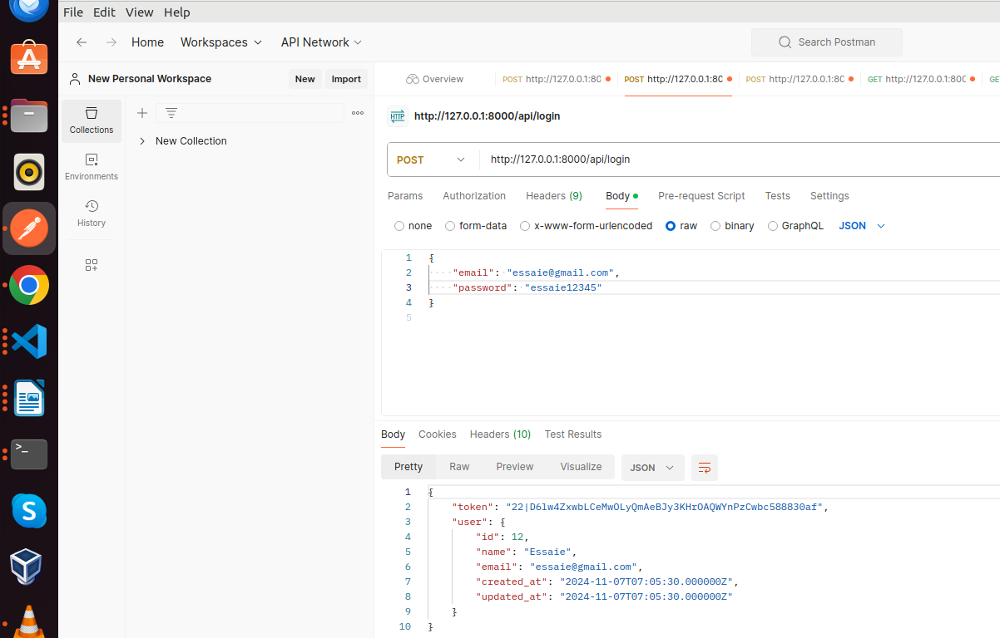

# Tasks Manager

Ce projet est une application web utilisant un backend Laravel pour l'API et un frontend Vue.js .

## Prérequis

- PHP ^8.1
- Composer 2
- Node.js ^16.x (pour Vue.js)
- Vue.js 3
- MySQL 8
- Git

## Structure du projet

```
test-themis/
├── backend/               # Backend Laravel
├── frontend/              # Frontend Vue.js 3
└── README.md              # Documentation du projet
```

## Installation et exécution

### 1. Cloner le dépôt

```bash
git clone https://github.com/adjimi-lionelle/test-themis.git
cd project-root
```

### 2. Configuration du backend (Laravel)

1. Aller dans le dossier `backend` :

    ```bash
    cd backend
    ```

2. Installer les dépendances PHP avec Composer :

    ```bash
    composer install
    ```

3. Configurer l'environnement :

    - Dupliquer le fichier `.env.example` en `.env` et ajuster les valeurs si nécessaire.
    DB_CONNECTION=mysql
    DB_HOST=127.0.0.1
    DB_PORT=3306
    DB_DATABASE=laravel
    DB_USERNAME=root      
    DB_PASSWORD=             
    

4. Générer la clé d'application Laravel :

    ```bash
    php artisan key:generate
    ```

5. Exécuter les migrations et les seeders (pré-remplir la base de données) :

    ```bash
    php artisan migrate --seed
    ```

6. Lancer le serveur de développement Laravel :

    ```bash
    php artisan serve
    ```

7. Le backend sera accessible à `http://localhost:8000`. // adapté en fonction de ce que vous aurez comme retour 

8. Lancer les tests du backend (optionnel) :

    ```bash
    php artisan test
    ```

### 3. Configuration du frontend (Vue.js)

1. Aller dans le dossier `frontend` :

    ```bash
    cd ../frontend
    ```

2. Installer les dépendances Node.js :

    ```bash
    npm install
    ```

3. Mettre à jour le fichier `main.ts` pour pointer vers l'URL de l'API backend :

    ```typescript
    import axios from 'axios';
    axios.defaults.baseURL = "http://localhost:8000/api"; // Lien vers l'API du backend 
    ```

4. Lancer le serveur de développement Vue.js :

    ```bash
    npm run serve
    ```

5. Le frontend sera accessible à `http://localhost:8080`.

### 4. Accès aux services

- **Backend Laravel** : `http://localhost:8000`
- **Frontend Vue.js** : `http://localhost:8080`

## API Documentation

### Base URL

`http://localhost:8000/api`

### Endpoints

- `POST /login` : Authentification de l'utilisateur
- `POST /register` : Création d'un nouvel utilisateur
- `POST /logout` : Déconnexion d'un utilisateur
- `GET /tasks` : Liste des tâches (nécessite authentification)
- `POST /tasks` : Création d'une nouvelle tâche
- `PUT /tasks/{id}` : Mise à jour d'une tâche
- `DELETE /tasks/{id}` : Suppression d'une tâche


### Tests du backend

Pour tester l'API, exécutez :

```bash
cd backend
php artisan test
```

Cela va exécuter tous les tests définis pour vérifier le bon fonctionnement des endpoints.

## Notes supplémentaires

- **Seeders** : Les seeders peuvent être utilisés pour générer des données de test. Ils s'exécutent automatiquement avec `php artisan migrate --seed` ou individuellement avec `php artisan db:seed`.
- **Vue Router** : Le frontend utilise Vue Router pour gérer la navigation.
- **Authentification** : Le backend utilise Laravel Sanctum pour l'authentification. Assurez-vous que le token de session est inclus dans les requêtes API (via `Authorization: Bearer <token>`).


## Quelques images de test 

## Test frontend

1- Page de connexion 


2- Page de création de compte




3- Créer une tâche


4- Éditer une tâche


4- Liste des tâches


### Test Api

1- Créer un utilisateur 


2- Connexion 




3- Créer une tâche


4- Liste des tâches d'un utilisateur


5- Éditer une tâche


